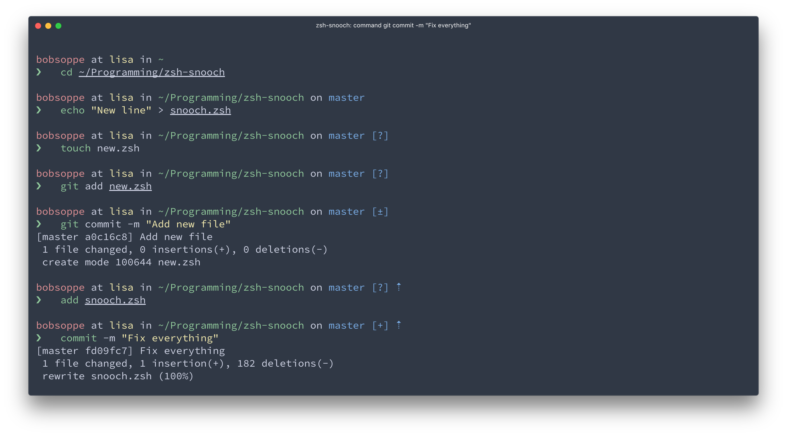

# Snooch
> It will snooch richt into your terminal prompt




## Install
1. Either…
  - Clone this repo
  - add it as a submodule, or
  - just download `snooch.zsh`

2. Symlink `snooch.zsh` to somewhere in [`$fpath`](http://www.refining-linux.org/archives/46/ZSH-Gem-12-Autoloading-functions/) with the name `prompt_snooch_setup`.

#### Example
```console
$ ln -s "$PWD/snooch.zsh" /usr/local/share/zsh/site-functions/prompt_snooch_setup
```
*Run `echo $fpath` to see possible locations.*

For a user-specific installation (which would not require escalated privileges), simply add a directory to `$fpath` for that user:

```sh
# .zshenv or .zshrc
fpath=( "$HOME/.zfunctions" $fpath )
```

Then install the theme there:

```console
$ ln -s "$PWD/snooch.zsh" "$HOME/.zfunctions/prompt_snooch_setup"
```


## Getting started
Initialize the prompt system (if not so already) and choose `snooch`:

```sh
# .zshrc
autoload -U promptinit; promptinit
prompt snooch
```


## Tips
In the screenshot you see Snooch running in [Hyper](https://hyper.is) with the [hyper-oceans16](https://github.com/henrikdahl/hyper-oceans16) theme and [Hasklig](https://github.com/i-tu/Hasklig) font.

To have commands colorized as seen in the screenshot, install [zsh-syntax-highlighting](https://github.com/zsh-users/zsh-syntax-highlighting).


## Integration
### [oh-my-zsh](https://github.com/robbyrussell/oh-my-zsh)
1. Symlink (or copy) `snooch.zsh` to `~/.oh-my-zsh/custom/snooch.zsh-theme`.
3. Set `ZSH_THEME="snooch"` in your `.zshrc` file.

Or skip the `oh-my-zsh` integration above and simply:

1. Set `ZSH_THEME=""` in your `.zshrc` to disable oh-my-zsh themes.
2. Follow the Snooch [Install](#install) instructions.

### [antigen](https://github.com/zsh-users/antigen)
Update your `.zshrc` file with the following line:

```sh
antigen bundle bobsoppe/zsh-snooch
```

### [antibody](https://github.com/getantibody/antibody)
Update your `.zshrc` file with the following line:

```sh
antibody bundle bobsoppe/zsh-snooch
```

### [zplug](https://github.com/zplug/zplug)
Update your `.zshrc` file with the following line:

```sh
zplug bobsoppe/zsh-snooch, use:snooch.zsh, from:github, as:theme
```
